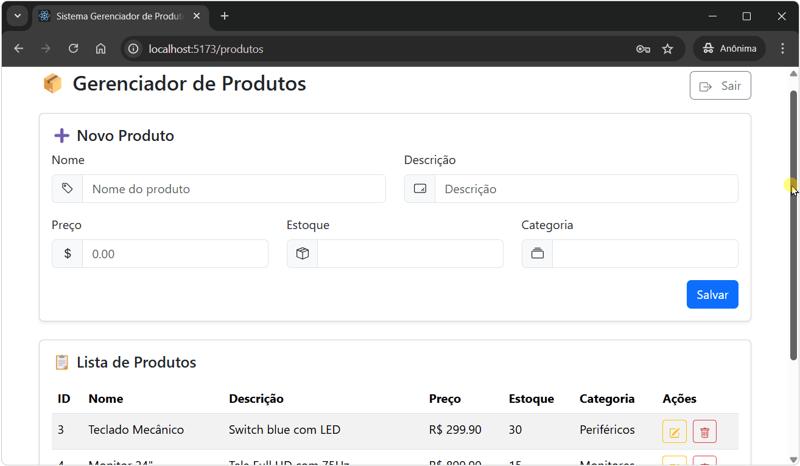

# Case FIEP Fullstack: Sistema de Produtos com Autenticação

Criado por **Silvio Sales do Nascimento Junior**

Repositório no GitHub [https://github.com/silviosnjr/caseFIEP](https://github.com/silviosnjr/caseFIEP)



Este projeto é uma aplicação fullstack composta por um backend em Node.js + Express com autenticação via JWT e um frontend em React, conectando-se a um banco de dados PostgreSQL.

## Tecnologias

- Backend: Node.js, Express, Sequelize, JWT, PostgreSQL
- Frontend: React, Axios
- Banco de dados: PostgreSQL
- Docker: para ambiente isolado e portável

## Como executar o projeto

### Pré-requisitos

- [Docker](https://www.docker.com/products/docker-desktop/) e [Docker Compose](https://docs.docker.com/compose/) instalados na máquina.
- [WSL (Windows Subsystem for Linux)](https://learn.microsoft.com/pt-br/windows/wsl/install) instalado e configurado (necessário apenas para Windows).


### Passo a passo

1. **Clone este repositório**:
```bash
git clone https://github.com/silviosnjr/caseFIEP.git
cd caseFIEP
```

2. **Suba os containers com Docker Compose**:
```bash
docker-compose up --build
```

> A aplicação irá:
> - Subir o PostgreSQL (com volume persistente)
> - Subir o backend (porta 3000)
> - Subir o frontend (porta 5173)

3. **Acesse no navegador**:
[http://localhost:5173](http://localhost:5173)

4. **Acesse o sistema com o seguinte usuário teste (pré-criado)**:

Email:
```
admin@fiep.org.br
```
Senha:
```
SilvioNaFiep2025
```

## Endpoints principais (backend)

| Método | Rota         | Protegida | Descrição              |
|--------|--------------|-----------|------------------------|
| POST   | /login       | ❌        | Autenticação via JWT   |
| GET    | /produtos    | ✅        | Lista todos os produtos|
| POST   | /produtos    | ✅        | Cria novo produto      |
| PUT    | /produtos/:id| ✅        | Atualiza um produto    |
| DELETE | /produtos/:id| ✅        | Remove um produto      |

[Baixar coleção Postman](./case-api/postman/collection.json)


### Testando a API
Você pode testar as rotas do backend com ferramentas como:
- [Postman](https://www.postman.com/)
- [Insomnia](https://insomnia.rest/)

As rotas da API estão disponíveis em: `http://localhost:3000`


## Estrutura dos diretórios
```
├── case-api        # Backend (Node.js)
│   ├── src
│   └── Dockerfile
├── case-frontend   # Frontend (React)
│   └── Dockerfile
├── docker-compose.yml
└── README.md
```
